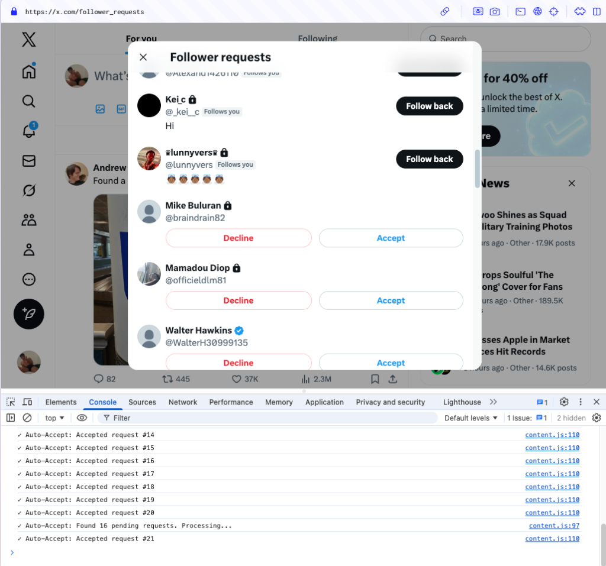

# AutoApprove - X Followers
 
A simple, safe, and smart Chrome Extension that automatically accepts follower requests on X (Twitter). It uses smart pacing, auto-scrolling, and intelligent list refreshing to manage your followers effortlessly.

## 📞 Contact

Created by **@hroh_** (Instagram). Feel free to reach out for feedback or support!



## 📖 Overview
 
**AutoApprove - X Followers** is designed to mimic human behavior to safely manage large numbers of follower requests. 

### How It Works

The extension works seamlessly within your existing browser session—no login required, no passwords needed, and no data ever leaves your browser. Here's what happens:

1. **Uses Your Active Session**: The extension operates entirely within your current X/Twitter browser session. Since you're already logged in, it simply interacts with the page as if you were clicking the buttons yourself.

2. **You Initiate the Process**: The automation only starts when **you** navigate to your Pending Followers page (`x.com/follower_requests`). The extension never runs in the background or operates without your knowledge.

3. **Smart Automation**: 
   - **Auto-Click**: Clicks "Accept" on visible requests.
   - **Anti-Bot Protection**: Uses randomized delays (1-3s) and occasional simulated "breaks" to avoid detection.
   - **Auto-Scroll & Retry**: Automatically scrolls to load more. If the list seems empty, it reloads the page once to double-check.
   - **Auto-Completion**: If no requests are found after a reload, it alerts you and redirects to your Home feed.

4. **Complete Transparency**: Every action is logged in your browser's console.

### Why It's Safe

- ✅ **No Login Required**: Uses your existing browser session—never asks for credentials
- ✅ **No Data Collection**: Doesn't collect, store, or transmit any of your personal information
- ✅ **No External Connections**: Everything happens locally in your browser
- ✅ **No Background Activity**: Only runs when you're actively on the Pending Followers page
- ✅ **Fully Transparent**: Open-source code that you can inspect and verify
- ✅ **You're in Control**: Start, pause, or stop at any time by scrolling or navigating away

The extension simply automates the repetitive task of clicking "Accept" buttons—nothing more, nothing less. It's like using your keyboard's Tab and Enter keys to speed through approvals, but even faster and more convenient.

## ✨ Features

- ✅ **Smart Processing**: Automatically accepts follower requests as they load.
- 🛡️ **Anti-Bot Tech**: Randomized delays (1-3s) and variable scroll wait times.
- ☕ **Simulated Breaks**: Takes short pauses every 20-30 clicks to mimic human fatigue.
- 🔄 **Smart Retry**: Auto-reloads the page if the list appears empty.
- 🏁 **Auto-Redirect**: Redirects to Home when all requests are processed.

## 📦 Installation

### For Arc Browser or Chrome:

1. **Open Extensions Page**
   - **Arc**: Navigate to `arc://extensions/`
   - **Chrome**: Navigate to `chrome://extensions/`

2. **Enable Developer Mode**
   - Toggle "Developer mode" in the top-right corner

3. **Load the Extension**
   - Click "Load unpacked"
   - Select the folder containing the extension files

4. **Ready to Use!**
   - Navigate to your follower requests page and watch it work

## 🎯 How to Use

1. **Login to X (Twitter)**.
2. **Go to Pending Followers**: `https://x.com/follower_requests`.
3. **Watch it Work**:
   - The extension activates automatically.
   - It will process requests with random human-like delays.
   - It will scroll, reload, and verify the list until empty.
   - When finished, it will alert you and go to Home.
4. **Monitor**: Open Console (`F12`) to see the detailed logs of every action.


## 🔧 How It Works

### Intelligent Logic
1. **Detection**: Activates on `/follower_requests`.
2. **Randomization**: Waits 1-3 seconds between clicks.
3. **Fatigue Simulation**: Pauses for 5-10 seconds every ~25 clicks.
4. **Verification**: If no buttons found -> Scroll -> Wait -> Check Again.
5. **Double Check**: If still empty -> Reload Page -> Check Again.
6. **Completion**: If truly empty -> Redirect to Home.

## 📊 Console Logs

```
✓ Auto-Accept: Extension activated on follower requests page
✓ Auto-Accept: Will automatically accept requests as they appear
✓ Auto-Accept: Scroll down to load more requests
✓ Auto-Accept: Accepted request #1
✓ Auto-Accept: Accepted request #2
✓ Auto-Accept: Accepted request #3
...
```

## ⚙️ Configuration

You can modify the delay between clicks in `content.js`:

```javascript
const PROCESSING_DELAY = 300; // Delay between button clicks (in milliseconds)
```

## 🐛 Troubleshooting

**Extension not working?**
- Make sure you're on the correct URL: `/follower_requests`
- Check the console (`F12`) for messages
- Try reloading the page

**Buttons not being clicked?**
- X/Twitter may have changed their button text or structure
- Check the console for any error messages
- Verify the button text is exactly "Accept"

**Nothing happening?**
- Make sure you're logged into X/Twitter
- Ensure you have pending follower requests
- Check that the extension is enabled in your browser

## 🔒 Privacy & Safety

**Your security and privacy are our top priorities.** Here's our commitment to you:

### What We DON'T Do
- ❌ **Never access your password** - We use your existing browser session
- ❌ **Never collect your data** - No analytics, no tracking, nothing
- ❌ **Never store information** - Everything happens in real-time, nothing is saved
- ❌ **Never send data externally** - No servers, no APIs, no external connections
- ❌ **Never run in background** - Only active when you're on the Pending Followers page
- ❌ **Never access other pages** - Restricted to follower requests page only

### What We DO
- ✅ **Use your browser session** - Safely interact with X using your existing login
- ✅ **Process locally** - All actions happen directly in your browser
- ✅ **Show transparency** - Every action is logged and visible in the console
- ✅ **Give you control** - You start, pause, and stop the process
- ✅ **Keep it simple** - Just clicks "Accept" buttons—nothing else
- ✅ **Stay open source** - Full code available for inspection

### Technical Safeguards
- **No Special Permissions**: The extension doesn't require access to your data, cookies, or any sensitive browser features
- **Session-Based**: Works entirely within your existing X/Twitter session without requiring credentials
- **Content Script Only**: Runs as a simple content script that only interacts with visible page elements
- **No Background Process**: Completely stops when you leave the follower requests page

**Bottom Line**: This extension is as safe as manually clicking the "Accept" buttons yourself—it just does it faster and saves you time.

## 📝 Files Included

- `manifest.json` - Extension configuration
- `content.js` - Main functionality script
- `README.md` - This file

## ⚠️ Disclaimer

This extension is provided as-is for personal use. Automated actions may violate X/Twitter's Terms of Service. Use at your own discretion and risk.

## 💡 Tips

- **Use Responsibly**: Don't leave it running unattended for extended periods
- **Take Breaks**: Manually pause by not scrolling or by navigating away
- **Monitor Console**: Keep console open to see what's happening
- **Control Speed**: Scroll slowly to accept at a measured pace

---

Made with ❤️ for the X/Twitter community
